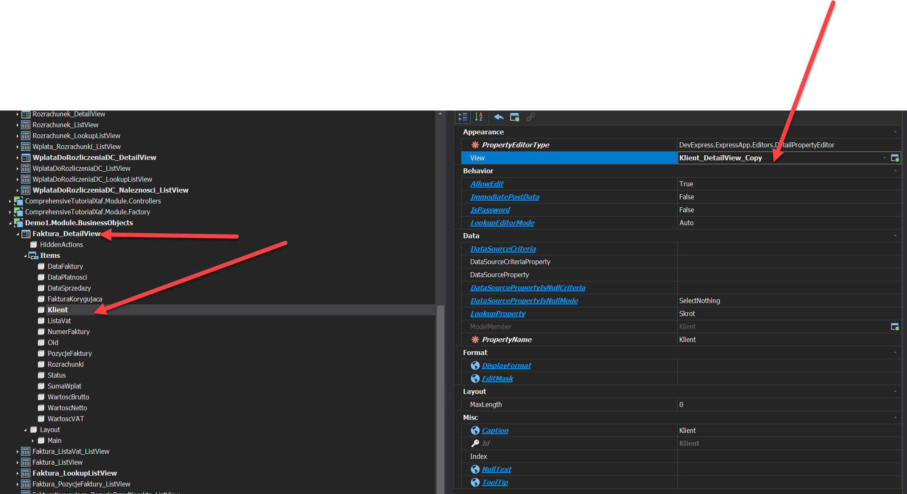

# chcemy aby w fakturze dane klienta mozna bylo wpisac bezposrednio na pierwszym oknie


dodajemy atrybuty do pola klient aby pokazywal wszyskie pola

```csharp

[EditorAlias(EditorAliases.DetailPropertyEditor)]
[ExpandObjectMembers(ExpandObjectMembers.Never)]
public Klient Klient
{
    get => klient;
    set
...

```

na after construction tworzymy nowy rekord

```csharp
public override void AfterConstruction()
{
    base.AfterConstruction();
    Klient = new Klient(Session);

}
```

potrzebujemy funkcje ktora poinformuje nas czy podany obiekt jest nowododany - 
```csharp
private bool IsNewObject(Klient obj)
{
    IObjectSpace objectSpace = XPObjectSpace.FindObjectSpaceByObject(obj);
    return objectSpace != null && objectSpace.IsNewObject(obj);
}
```
takie chcemy usuwac jesli zmieni sie klient w fakturze z nowego na istniejący:

```csharp
public Klient Klient
{
    get => klient;
    set
    {
        var oldKlient = klient;

        var modified = SetPropertyValue(nameof(Klient), ref klient, value);

        if (modified && !IsLoading && !IsSaving && Klient != null)
        {

           

            if (oldKlient != null && IsNewObject(oldKlient) && oldKlient != Klient)
            {
                oldKlient.Delete();
            }
            DataPlatnosci = DataFaktury.AddDays(Klient.TerminPlatnosci);

        }
    }
}
```


teraz pora na kontroller który bedzie kontrolował zmiane na polu - tu uzywam Nazwa, ale zamist tego moze byc np NIP:

```csharp
public class KlientDetailViewController :ObjectViewController<DetailView,Klient>
   {


       protected override void OnActivated()
       {
           base.OnActivated();
           ObjectSpace.ObjectChanged += ObjectSpace_ObjectChanged;
       }


       void ObjectSpace_ObjectChanged(object sender, ObjectChangedEventArgs e)
       {

           var parent = ObjectSpace.GetObject(((NestedFrame)Frame).ViewItem.CurrentObject as Faktura);

           if (View.CurrentObject == e.Object &&
                  e.PropertyName == nameof(Klient.Nazwa) &&
                  ObjectSpace.IsModified &&
                  e.OldValue != e.NewValue)
           {
               Klient changedContact = (Klient)e.Object;
               var newCustomer = ObjectSpace.GetObjectsQuery<Klient>().Where(k => k.Nazwa == (string)e.NewValue).FirstOrDefault();
               if (parent != null && newCustomer != null)
               {
                   
                   parent.ZmienKlienta(newCustomer);
                   View.Refresh();
                   changedContact.Nazwa = (string)e.OldValue; // tu przywracamy stara wartosc w rekordzie ktory zostal zamieniony nowym klientem
               }
            

           }
       }

       protected override void OnDeactivated()
       {
           base.OnDeactivated();
           ObjectSpace.ObjectChanged -= ObjectSpace_ObjectChanged;
       }
   }
```

W modelu dla klienta ustawiamy alternatywny edtor detailview - np bez listy faktur wpłat itp:




ukrywanie niuzywanych subdetailview

```csharp
//deklarujemy zmienna która informuje nas czy ukryc czy nie
private bool UkryjAdresKorespondencyjny => !InnyAdresKorespondecyjny;

[EditorAlias(EditorAliases.DetailPropertyEditor)]
[ExpandObjectMembers(ExpandObjectMembers.Never)]

// definiujemy regułe ukrywania - w tym przypadku uzalezniona od zmiennej UkryjAdresKorespondencyjny
[Appearance(nameof(UkryjAdresKorespondencyjny), Visibility = ViewItemVisibility.Hide, Criteria = nameof(UkryjAdresKorespondencyjny))]
public AdresKlienta AdresKorespondencyjny
{
    get => adresKorespondencyjny;
    set
    {
        var oldAdres = adresKorespondencyjny;
        bool modified = SetPropertyValue(nameof(AdresKorespondencyjny), ref adresKorespondencyjny, value);
        if (modified && !IsLoading && !IsSaving)
        {
            if (oldAdres != null && oldAdres != AdresKorespondencyjny  && oldAdres.IsNewObject)
            {
                oldAdres.Delete();
            }
            AdresyKlienta.Add(AdresKorespondencyjny);

        }
    }
}
```
